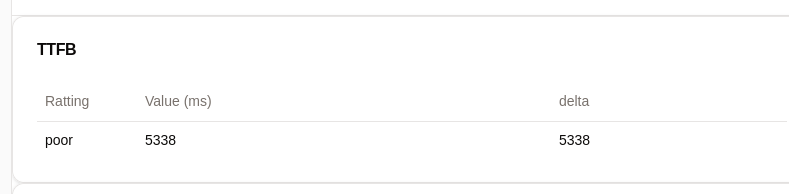
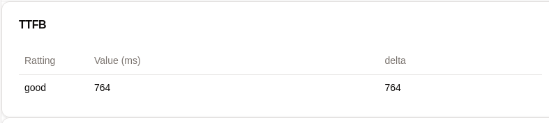

# Experimenting with Tech
* NextJS v15 (react v19)
* schadcn
* tailwind
* authjs (v5@beta) `pnpm dlx auth secret` `openssl rand -base64 12`
* sentry - error tracking
* sentry - user feedback
* upstash - for rate limiting

# Startup
* `docker compose --env-file .env up`

# Index creation Experiments
* getting 8k rows for a user with no indexes - takes 11ms.
```sql
EXPLAIN ANALYZE SELECT * FROM "test-pg_project" as p WHERE p."userId" = 1;
```
```
                                                      QUERY PLAN
-----------------------------------------------------------------------------------------------------------------------
 Seq Scan on "test-pg_project" p  (cost=0.00..145.00 rows=8000 width=15) (actual time=0.030..11.171 rows=8000 loops=1)
   Filter: ("userId" = 1)
 Planning Time: 0.146 ms
 Execution Time: 11.531 ms
(4 rows)
```

```sql
SELECT * FROM pg_indexes WHERE schemaname = 'public' AND tablename='test-pg_project';
```

```
 schemaname |    tablename    |      indexname       | tablespace |                                        indexdef
------------+-----------------+----------------------+------------+-----------------------------------------------------------------------------------------
 public     | test-pg_project | test-pg_project_pkey |            | CREATE UNIQUE INDEX "test-pg_project_pkey" ON public."test-pg_project" USING btree (id)
(1 row)
```

* with index on `project_name` there is a drastic improvement on retrieval
```
 schemaname |    tablename    |      indexname       | tablespace |                                        indexdef
------------+-----------------+----------------------+------------+-----------------------------------------------------------------------------------------
 public     | test-pg_project | test-pg_project_pkey |            | CREATE UNIQUE INDEX "test-pg_project_pkey" ON public."test-pg_project" USING btree (id)
 public     | test-pg_project | project_name_idx     |            | CREATE INDEX project_name_idx ON public."test-pg_project" USING btree (project_name)
(2 rows)
```

```
                                                      QUERY PLAN
----------------------------------------------------------------------------------------------------------------------
 Seq Scan on "test-pg_project" p  (cost=0.00..158.00 rows=8000 width=27) (actual time=0.061..2.550 rows=8000 loops=1)
   Filter: ("userId" = 1)
 Planning Time: 0.621 ms
 Execution Time: 2.831 ms
(4 rows)
```

## Foreign key index retrieval
* 1k prodcuts and 7k prodcut reviews.


```sql
EXPLAIN ANALYZE SELECT * FROM "test-pg_product_review" AS pr WHERE pr."product_id" = 38;
```
* without index it takes 1.4ms (prodcut 38 has 57 reviews)
```
                                                        QUERY PLAN
---------------------------------------------------------------------------------------------------------------------------
 Seq Scan on "test-pg_product_review" pr  (cost=0.00..379.50 rows=57 width=303) (actual time=0.016..1.407 rows=57 loops=1)
   Filter: (product_id = 38)
   Rows Removed by Filter: 6943
 Planning Time: 0.075 ms
 Execution Time: 1.428 ms
(5 rows)
```

* with index it took longer - 2.25ms
```
                                                            QUERY PLAN
-----------------------------------------------------------------------------------------------------------------------------------
 Bitmap Heap Scan on "test-pg_product_review" pr  (cost=4.72..147.61 rows=57 width=303) (actual time=0.683..2.216 rows=57 loops=1)
   Recheck Cond: (product_id = 38)
   Heap Blocks: exact=51
   ->  Bitmap Index Scan on product_id_fk_idx  (cost=0.00..4.71 rows=57 width=0) (actual time=0.577..0.578 rows=57 loops=1)
         Index Cond: (product_id = 38)
 Planning Time: 2.096 ms
 Execution Time: 2.251 ms
(7 rows)
```

* product 51 has highest review count 89 - took 7.73ms
```

                                                            QUERY PLAN
-----------------------------------------------------------------------------------------------------------------------------------
 Bitmap Heap Scan on "test-pg_product_review" pr  (cost=4.97..197.14 rows=89 width=303) (actual time=0.424..7.597 rows=89 loops=1)
   Recheck Cond: (product_id = 51)
   Heap Blocks: exact=73
   ->  Bitmap Index Scan on product_id_fk_idx  (cost=0.00..4.95 rows=89 width=0) (actual time=0.090..0.092 rows=89 loops=1)
         Index Cond: (product_id = 51)
 Planning Time: 1.112 ms
 Execution Time: 7.728 ms
(7 rows)
```

* without the index it took longer - 13.41 ms
```
                                                         QUERY PLAN
----------------------------------------------------------------------------------------------------------------------------
 Seq Scan on "test-pg_product_review" pr  (cost=0.00..379.50 rows=89 width=303) (actual time=0.732..13.372 rows=89 loops=1)
   Filter: (product_id = 51)
   Rows Removed by Filter: 6911
 Planning Time: 0.243 ms
 Execution Time: 13.405 ms
(5 rows)
```

# Redis Cache Experiments
* getting data from `/products/[id]` page
* caching helps a lot and can be easily controlled depending on what the user does
* e.g. if review is written about that product, then that product data key should be deleted



